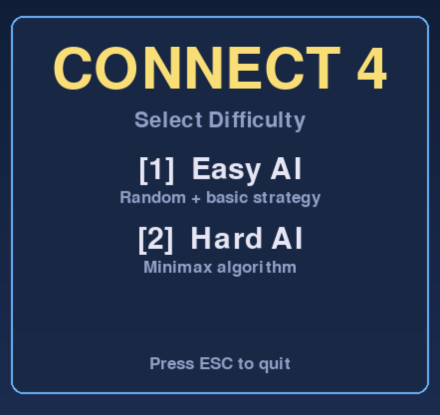
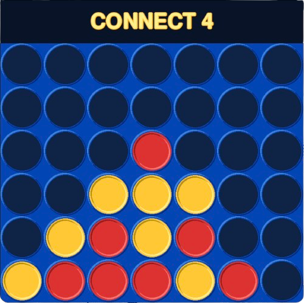

<div align="center">

# Connect4Zero


[]()

**A Connect 4 game featuring two AI opponents with different strategies and difficulty levels**

[About](#about) • [Features](#features) • [AI Algorithms](#ai-algorithms) • [Installation](#installation) • [Usage](#usage) • [Project Structure](#project-structure)

<br>

 &nbsp;&nbsp; 

</div>

---

## About

This project implements the classic **Connect 4** game in Python with Pygame, featuring two AI opponents of varying difficulty. The game showcases fundamental game theory concepts including the **Minimax algorithm** with position evaluation heuristics.

### Core Concept

```
Optimal Play = Minimax(game_tree, depth) + Evaluate(board_position) + Heuristics(threats)
```

The Hard AI uses a **depth-limited Minimax search** combined with strategic position evaluation to find optimal moves, while the Easy AI provides a more casual experience with randomized play.

---

## Features

### Game Features

| **Feature** | **Description** |
|-------------|-----------------|
| Two AI Modes | Easy (random) and Hard (Minimax) opponents |
| Visual Effects | Gradient backgrounds, 3D token shading |
| Sound System | Audio feedback for moves, wins, and menu |
| Responsive UI | Clean menus with keyboard controls |

### Controls

| **Key** | **Action** |
|---------|------------|
| `1` | Select Easy AI / Play again |
| `2` | Select Hard AI / Play again |
| `ESC` | Quit game |
| `Mouse` | Drop token in column |

---

## AI Algorithms

### Easy AI - Random Strategy

The Easy AI implements a **reactive strategy** with three priority levels:

```python
def get_move(board, player):
    1. If winning move exists     → Play it
    2. If opponent can win next   → Block it
    3. Otherwise                  → Random column
```

**Characteristics:**
- Predictable but not trivial
- Good for beginners
- Fast computation

### Hard AI - Minimax Algorithm

The Hard AI uses a sophisticated **Minimax search** with evaluation heuristics:

```python
def minimax(node, depth, maximizing_player):
    if depth == 0 or terminal_state:
        return evaluate(position)

    if maximizing:
        return max(minimax(child) for child in children)
    else:
        return min(minimax(child) for child in children)
```

**Evaluation Function Components:**

| **Component** | **Weight** | **Description** |
|---------------|------------|-----------------|
| Win Detection | ±1,000,000 | Terminal state detection |
| Threat Analysis | 5-10x | Consecutive tokens in all directions |
| Position Value | 80x | Center positions score higher |

**Position Value Matrix:**
```
[ 3,  4,  5,  7,  5,  4,  3]
[ 4,  6,  8, 10,  8,  6,  4]
[ 5,  8, 11, 13, 11,  8,  5]
[ 5,  8, 11, 13, 11,  8,  5]
[ 4,  6,  8, 10,  8,  6,  4]
[ 3,  4,  5,  7,  5,  4,  3]
```

**Characteristics:**
- Search depth: 4 moves ahead
- Opening optimization: Always plays center
- Very challenging to beat

---

## Installation

### Prerequisites

- Python 3.7+
- NumPy
- Pygame

### Setup

```bash
# Clone the repository
git clone https://github.com/mathisdelsart/Connect4Zero.git
cd Connect4Zero

# Install dependencies
pip install pygame numpy

# Run the game
python main.py
```

---

## Usage

### Playing the Game

1. Launch with `python main.py`
2. Select difficulty: `1` for Easy, `2` for Hard
3. Click columns to drop your red tokens
4. Connect 4 horizontally, vertically, or diagonally to win

### Monte Carlo Simulation

Compare AI performance with statistical analysis:

```bash
python montecarlo.py
```

Runs tournaments between Hard AI and Easy AI, generating win rate statistics and visualization graphs.

---

## Project Structure

```
Connect4_AI/
├── main.py                 # Entry point
├── montecarlo.py           # AI performance benchmarking
├── src/
│   ├── configs.py          # Game settings, colors, fonts, sounds
│   ├── functions.py        # Core logic: board ops, win detection, minimax
│   ├── game.py             # Game loop, rendering, event handling
│   └── players/
│       ├── player.py       # Human player (console mode)
│       ├── easy_ai.py      # Easy AI - random with basic strategy
│       └── hard_ai.py      # Hard AI - minimax algorithm
└── assets/
    ├── sounds/             # Audio files (drop, win, lose, select)
    └── *.png               # Game images
```

---

## Game Rules

1. Players alternate turns dropping tokens into columns
2. Tokens fall to the lowest available row
3. First to connect **4 tokens in a row** wins
4. Connections: horizontal, vertical, or diagonal
5. **Draw** if all 42 cells are filled

---

## Author

<div align="center">

<table>
  <tr>
    <td width="180" align="left">
      
    </td>
    <td align="left">
      <strong>Mathis DELSART</strong>
    </td>
  </tr>
</table>

</div>